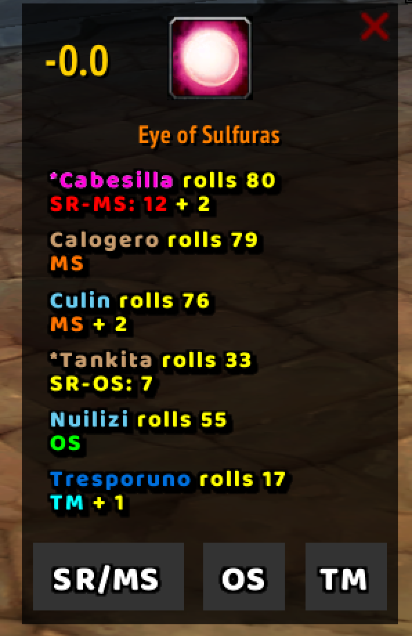

# Loot Blare 2.0.0

Loot Blare is a World of Warcraft addon originally designed **Turtle WoW**. The original version of this addon can be found [here](https://github.com/MarcelineVQ/LootBlare). This version of Loot Blare was completely updated by and for the **Conquistadores** guild.

This addon displays a pop-up frame showing items and rolls when a single uncommon+ item is linked in Raid Warning. Rolls are automatically sorted by type to streamline the master looter's workflow. This addon follows the following rules:  
`SR-MS > MAIN-MS > ALT-MS > SR-OS > MAIN-OS > ALT-OS > TM`

### Features:

- **Start Rolling**: To start the rolling process, send the item as a **Raid Warning**. This will trigger the frame to appear and display rolls. The frame will appear only if the sender is the ML

- **Roll Sorting**: Rolls are automatically categorized and sorted by type to streamline loot distribution. Only the first roll submitted by each player is considered; subsequent rolls are ignored.

- **Show/Hide Frame**: To show or hide the frame, type:  
  `/lootblare` or `/lb`  
  If the frame is active, you can move it by dragging.

- **Easy Roll Buttons**: For raiders, the addon provides convenient roll buttons:

  - **SR/MS (Soft Reserve or Main Spec)**: Rolls from 1 to 100.
  - **OS (Off Spec)**: Rolls from 1 to 99.
  - **TM (Transmog)**: Rolls from 1 to 50.

- **Frame Duration**: By default, the frame stays on screen for `15 seconds` unless a new roll occurs. Adjust this duration with:  
  `/lootblare time <number>` or `/lb 'time <number>`

  Example: `/lootblare time 30` to set the duration to 30 seconds.

Every time the master looter changes, the new master looter announces the roll time defined. This value is also announced after updating the value with `/lb time <number>`. This announced value is applied to the entire raid to ensure consistency.

- **Auto-Close**: The frame closes automatically after the set time. Toggle this feature on or off with:  
  `/lootblare ac on/off` or `/lb ac on/off`

- **Auto-Close when using a spell**: After the time ends, close the frame when using a spell. Toggle this feature on or off with:
  `/lootblare hwus on/off` or `/lb hwus on/off`

- **Configuration Commands**: For a full list of configuration options, type:  
  `/lb help`

- **Handle SR+ from CSV, Alts, and +1**:
This addon handles soft reserves (SRs) imported from CSV. Specifically, it supports the CSV export from [raiders.fly.dev](https://raidres.fly.dev/). To export correctly, someone must validate the SRs and then export the CSV while selecting only the following columns:`ID,Item,Attendee,Comment and SR+`. The web has an option for the admins to validate the SR number of the attendees, all the invalid SRs will be exported with SR+=0 and the addon will ignore these SRs, so the minimum SR valid values is 1. 
Once the CSV is imported, the addon provides several commands to manage soft reserves, alts, and the plus one system.

- **General Commands available for all the players**.  
`/lb al` - Show the alts list.  
`/lb pol` - Show the plus one list.

- **Master Looter Commands**  
`/lb sr` - Open the soft reserve frame.  
`/lb src` - Clear the soft reserve list.  
`/lb aa alt1,alt2,alt3,...,altN` - Add alts to the alts list.  
`/lb ar alt1,alt2,alt3,...,altN` - Remove alts from the alts list.  
`/lb po <player>` - Increase the plus one count for a player.  
`/lb mo <player>` - Reduce the plus one count for a player.  
`/lb poc` - Clear the plus one list.  

- **Alts Logic**  
Alts are marked with an `*` in their names. When rolling an item the alts will always have less priority than main characters in the same roll group

- **Plus One System**  
The plus one system helps manage loot distribution by tracking a player's "Plus One" count. When a player receives an item, they can be given a plus one using `/lb po <player>` (or clicking their name in the roll frame), which decrease their priority for future loot distribution. If needed, the count can be reduced using `/lb mo <player>` (or right clicking the name in the roll frame), or the entire list can be cleared with `/lb poc`.

- **Prioritize mains over alts toggle button**  
In the roll frame the master looter can choose if mains will get prio over alts. This toggle value is sent to all the raiders and the roll list is sorted accordingly for everyone

- **Minimap button shortcuts**  
The minimap button has the following shortcuts:  
`Left-click`: opens the roll frame  
`Right-Click`: opens the settings frame  
`Shift + Left-Click (for ML only)`: opens the import SR frame

- **Communication**: The addon uses the addon channel to update data about settings, SRs, alts and plus one for all the members of the raid  

### The (moveable) frame in game:

Changelog:
- **1.2.0**: Refactor the whole addon. Added SR, alts, and +1 logic.
- **1.1.9**: Add communication using CHAT_MSG_ADDON events
- **1.1.8**: Remove announce message after each roll. Added time announce message after changing master loot
- **1.1.7**: Added class colors, autoClose option, and config commands. Only show frame if the sender is the ML. Ignore rolls after the time has elapsed. Get FrameShowDuration from the ML.
- **1.1.6**: Simple Buttons and Tooltips.
- **1.1.5**: Added button for SR and roll type order and color.
- **1.1.4**: Added more buttons for OS and Tmog. Now only registers the first roll of each player.
- **1.1.3**: Added MainSpec Button for rolling.
